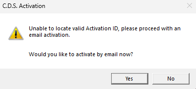

# Trace 3D and Load 300 activation fix.ps1

## Fixes Trane/C.D.S.'s activation issue post their internal cyber sec update 2/6/2023, causing Trane 3D or Trace Load 300 to request you to re-activate but never allowing you to reactivate with their cloud licenses.

## DESCRIPTION

Fixes Trane/C.D.S.'s activation issue post their internal cyber sec update 2/6/2023,

causing Trane 3D or Trace Load 300 to request you to re-activate but never allowing you

to reactivate with their cloud licenses..

## Notes

Tested working in 7.X.X.

## INPUTS

None.

## OUTPUTS

System.Strings, Verbosly stating the function steps it is doing.

VERBOSE: Trace 3D and Load 300 activation fix.ps1 script starting...written by DAM, last modified on 2023-03-06

VERBOSE: Get-TRACELoad700

VERBOSE: Get-TRACE3DPlusProcess

VERBOSE: Get-FixDownload

VERBOSE: Export-ZippedFiles

VERBOSE: Add-FixFilesforTrace700

VERBOSE: Add-FixFilesforTrace3D

VERBOSE: Start-Trace700

VERBOSE: Start-Trace3D

VERBOSE: Remove-DownloadedItems

VERBOSE: The script has finished, now remote into the users PC and active the licneses for Trace 3D and 700.

## LINK

[about_Throw](https://learn.microsoft.com/en-us/powershell/module/microsoft.powershell.core/about/about_throw?view=powershell-7.3)

[about_Functions](https://learn.microsoft.com/en-us/powershell/module/microsoft.powershell.core/about/about_functions?view=powershell-7.3)

[Write-Verbose](https://learn.microsoft.com/en-us/powershell/module/microsoft.powershell.utility/write-verbose?view=powershell-7.3)

[about_Try_Catch_Finally](https://learn.microsoft.com/en-us/powershell/module/microsoft.powershell.core/about/about_try_catch_finally?view=powershell-7.3)

[Write-Error](https://learn.microsoft.com/en-us/powershell/module/microsoft.powershell.utility/write-error?view=powershell-7.3)

[Invoke-WebRequest](https://learn.microsoft.com/en-us/powershell/module/microsoft.powershell.utility/invoke-webrequest?view=powershell-7.3)

[Expand-Archive](https://learn.microsoft.com/en-us/powershell/module/microsoft.powershell.archive/expand-archive?view=powershell-7.3)

[Copy-Item](https://learn.microsoft.com/en-us/powershell/module/microsoft.powershell.management/copy-item?view=powershell-7.3)

[Start-Process](https://learn.microsoft.com/en-us/powershell/module/microsoft.powershell.management/start-process?view=powershell-7.3)
